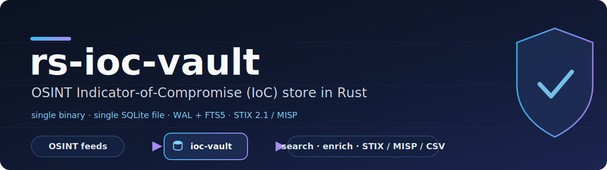

<p align="center">
  
</p>

# rs-ioc-vault

OSINT 由来の脅威インジケータ (IoC) を正規化・重複排除して 1 つの SQLite ファイルに集約する，軽量な IoC ストアです．単一バイナリ `ioc-vault` (CLI) と公開ライブラリ `rs-ioc-vault` を提供し，URLhaus / ThreatFox / CISA KEV などのフィードを取り込み，複合条件検索・時間減衰スコアリング・STIX 2.1 / MISP / CSV / JSONL でのエクスポートを行えます．

## インストール

Rust ツールチェイン (edition 2024 対応) が必要です．

```bash
# CLI バイナリ ioc-vault を導入
cargo install --git https://github.com/akitenkrad/rs-ioc-vault ioc-vault-cli
```

ソースからビルドする場合:

```bash
git clone https://github.com/akitenkrad/rs-ioc-vault
cd rs-ioc-vault
cargo build --release          # バイナリは target/release/ioc-vault
cargo test --workspace         # テスト
```

導入後の動作確認:

```bash
ioc-vault init
ioc-vault source list
```

## ドキュメント

- [ユースケース](docs/usecases.md) — 代表的な利用シナリオ
- [CLI リファレンス](docs/cli.md) — `ioc-vault` の全コマンド
- [ライブラリ利用](docs/library.md) — `rs-ioc-vault` を依存に追加して使う
- [アーキテクチャ](docs/architecture.md) — クレート構成とデータの流れ

## ライセンス

Apache-2.0
